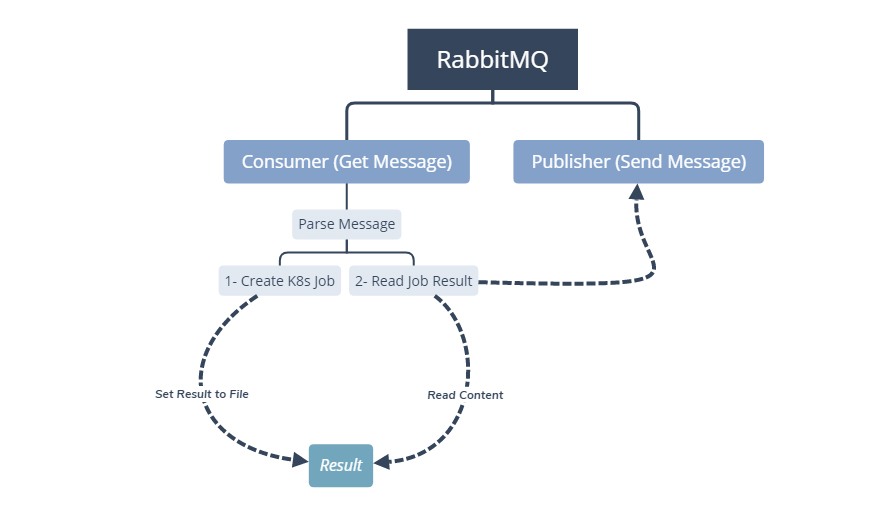

# Sheltie

This application recieves messages from **RabbitMQ** and creates **Kubernetes** jobs based on the messages, then returning the status back to rabbitmq (if kubernetes job results considered to be saved on a file)

<p align="center">
  
</p>

## Used Libraries :

* [Go RabbitMQ Client (amqp)](https://github.com/streadway/amqp)

* [Go Kubernetes Client (client-go)](https://github.com/kubernetes/client-go)

* [Go HTTP and REST client (resty)](https://github.com/go-resty/resty)

* [Go YAML support (yaml)](https://github.com/go-yaml/yaml)

## Structure :

* Config :


    | Fields                | Type       | Desc          
    |:--------------------- |:---------- |:------------------------------------------------------------------
    | k8s_ConfigFilePath    | String     | Kubernetes config file path, placed in "/root/.kube/config" by default.
    | k8s_NameSpace         | String     | Kubernetes namespace
    | k8s_NodeName          | String     | Kubernetes node
    | k8s_Priority          | Int64      | Kubernetes pod priority
    | k8s_Labels            | JSON       | Kubernetes pod labels
    | k8s_Annotations       | JSON       | Kubernetes pod annotations
    | rabbit_User           | String     | Rabbitmq user
    | rabbit_Pass           | String     | Rabbitmq password
    | rabbit_Host           | String     | Rabbitmq host
    | rabbit_Port           | String     | Rabbitmq port
    | rabbit_CommandQueue   | String     | Rabbitmq command queue name
    | rabbit_ResultQueue    | String     | Rabbitmq result queue name
    | alias                 | JSON Array | Alias is set of keys & values so if any key used in messages it would be replaced by its value.


* Command Message :


    | Fields   | Type       | Desc          
    |:-------- |:---------- |:------------------------------------------------------------------
    | type     | String     | Allowed Values: "**K8sPod**" , "**ReadFile**"
    | file     | String     | **Kubernetes** file path (pod YAML file) or **Result** file path
    | commands | [][]String | [container_index][commands]String
    | args     | [][]String | [container_index][args]String

## How to build :


* **Install Golang > v1.8.x** 


* **Install "Go RabbitMQ Client" :** 

```
go get github.com/streadway/amqp
```

* **Install "Go Kubernetes Client" :** 


```
go get k8s.io/client-go/...
```

```
go get -u k8s.io/apimachinery/...
```

* **Install "Go HTTP and REST client" :** 

```
go get -u gopkg.in/resty.v1
```

* **Install "Go YAML support" :** 

```
go get gopkg.in/yaml.v2
```


* **Go to project root directory :** 

```
go build sheltie.go
```
